<div align="center">



<a href="https://github.com/sai46-ai/sai46-ai">
  
</a>

<br/>

<p align="center"><a href="#about"></a> <a href="#featured-projects"></a> <a href="#tech-stack"></a> <a href="#currently-learning"></a> <a href="#achievements"></a> <a href="#connect"></a></p>

</div>

---

## About

I'm a final-year B.Tech student in Artificial Intelligence and Data Science at Vasireddy Venkatadri Institute of Technology (VVIT), Andhra Pradesh, graduating in 2027.

I build full-stack applications where a model or an LLM does a specific job inside a normal software system: resume parsing for campus hiring, anomaly detection on cloud bills, bill prediction for household electricity, a chatbot with stored conversation history. Most of my work sits between a React frontend, an API layer (FastAPI, Express or Flask), a database, and a small AI service.

I'm looking for software engineering and AI engineering roles and internships, with full-stack and GenAI application work as the closest fit.

---

## Engineering Profile

```text
┌───────────────────────────────────────────────────────────┐
│                    ENGINEERING PROFILE                    │
├───────────────────────────────────────────────────────────┤
│ Education     : B.Tech, AI & Data Science (2023 - 2027)   │
│ Institution   : VVIT, Andhra Pradesh, India               │
│ CGPA          : 8.95 / 10                                 │
│ Primary focus : Full-stack development with AI services   │
│ AI focus      : NLP, anomaly detection, LLM integration   │
│ Backend       : FastAPI, Node.js / Express, Flask         │
│ Data          : PostgreSQL, MongoDB, SQLAlchemy, Alembic  │
│ Cloud         : AWS (Cost Explorer, EC2), Docker          │
│ Status        : Open to internships and entry-level roles │
└───────────────────────────────────────────────────────────┘
```

| Domain | Current focus |
|---|---|
| Software engineering | Full-stack apps with role-based auth, REST APIs and dashboards |
| AI engineering | Resume NLP, Isolation Forest anomaly detection, LLM chat integration |
| Data | Relational schemas and migrations, cost and usage analytics, forecasting |
| Backend | FastAPI, Express, Flask, Celery and Redis background jobs |
| Cloud | AWS Cost Explorer integration, Docker Compose, Nginx |

---

## Featured Projects

Click a card to open the repository. Open the sections below for features and architecture.

<div align="center">

<a href="https://github.com/sai46-ai/cloud-cost-optimizer"></a>
<a href="https://github.com/sai46-ai/AI-Campus-Recruitment-System"></a>
<a href="https://github.com/sai46-ai/Electricity-Billing-and-Budget-Optimization-System"></a>
<a href="https://github.com/sai46-ai/ai-chatbot-react-flask"></a>

</div>

<details>
<summary><b>CloudWise AI - Cloud cost optimization and FinOps platform</b></summary>

[Repository](https://github.com/sai46-ai/cloud-cost-optimizer)

**Why it matters:** cloud bills are hard to read and spikes go unnoticed. CloudWise pulls spend data, flags unusual changes and suggests where to cut cost.

**What it does**
- Cost breakdowns by service, region, account and date, with budget thresholds at 50, 80, 90 and 100 percent
- Anomaly detection with scikit-learn's Isolation Forest, scored by severity
- LLM-based assistant that explains anomalies and rightsizing suggestions
- Rightsizing suggestions for EC2, RDS and S3
- PDF, CSV and Excel report export
- JWT auth, role-based access, multi-tenant organizations, audit log API, rate limiting
- Celery and Redis for background jobs, Docker Compose and Nginx for deployment

```text
React + TypeScript (Vite)
        │
        ▼
FastAPI  ──── JWT / RBAC / rate limiting
   │
   ├── PostgreSQL (SQLAlchemy, Alembic)
   ├── Redis ── Celery workers
   ├── Cost Explorer / CloudWatch (AWS provider)
   └── AI layer
        ├── Isolation Forest (anomaly detection)
        └── LLM assistant
```


</details>

<details>
<summary><b>AI Campus Recruitment System</b></summary>

[Repository](https://github.com/sai46-ai/AI-Campus-Recruitment-System)

**Why it matters:** campus hiring means sorting through hundreds of resumes by hand. This system parses resumes, extracts skills and scores candidates with a formula that can be inspected.

**What it does**
- Resume parsing for PDF and DOCX, skill extraction with spaCy and a custom skill list
- Semantic skill matching with sentence-transformers
- Scoring across skills, experience, education and resume quality
- Student, recruiter and admin roles; jobs, applications, interviews and notifications
- Upload validation, auth and rate-limit middleware

```text
React frontend  ◄──►  Node / Express API  ◄──►  Python FastAPI AI service
                              │                        │
                              └────────  MongoDB  ─────┘
```


</details>

<details>
<summary><b>Electricity Billing and Budget Optimization System</b></summary>

[Repository](https://github.com/sai46-ai/Electricity-Billing-and-Budget-Optimization-System)

**Why it matters:** households see a bill after the month ends. This app estimates usage from appliances, predicts the bill and shows how to stay inside a budget.

**What it does**
- Slab-tariff billing, bill payment flow, PDF bills, in-app notifications
- Bill and unit prediction with linear regression and random forest, best model chosen by MAE
- Budget advisor that ranks appliances by priority and suggests usage hours
- Admin analytics and monthly reports
- JWT roles (admin, customer), Helmet, rate limiting
- ML code runs as a separate Node.js service with a retraining endpoint


</details>

<details>
<summary><b>AI Chatbot (React and Flask)</b></summary>

[Repository](https://github.com/sai46-ai/ai-chatbot-react-flask)

A chat app that sends the last 10 exchanges as context to LLaMA 3.3 70B through the Groq API and stores every conversation in MongoDB. Includes a `/health` endpoint that checks the server and the database.


</details>

---

## Tech Stack

### Building with
Technologies I've used in the projects above.


| Area | Tools |
|---|---|
| Languages | Python, JavaScript, TypeScript, SQL |
| Frontend | React, Vite, Recharts, Tailwind CSS |
| Backend | FastAPI, Express, Flask, Celery, JWT auth |
| Databases | PostgreSQL, MongoDB, SQLAlchemy, Alembic, Mongoose |
| AI / ML | scikit-learn (Isolation Forest, random forest, regression), spaCy, sentence-transformers, LLM APIs (Groq, Gemini) |
| Infra | Docker, Docker Compose, Nginx, AWS |

### Working knowledge
Java, MySQL, Linux, HTML, CSS, Bootstrap, Postman

### Currently learning
RAG, vector databases, LangChain, LlamaIndex, MLOps, system design

---

## Currently Learning

<details>
<summary>Open the list</summary>

<br/>

- **RAG pipelines:** chunking, embeddings, retrieval and evaluation
- **Vector databases** and where they fit in an LLM application
- **LLM tooling:** LangChain and LlamaIndex
- **MLOps and deployment:** packaging, serving and monitoring models
- **System design:** scaling APIs, caching and queues
- **SQL:** deeper query work on PostgreSQL

</details>

---

## Open to Work

No internship or full-time experience yet. My experience so far comes from the projects above, and I'm looking for an internship or entry-level role in software or AI engineering.

---

## Achievements

<!-- TODO: add proof links (certificate URL, SIH result page, CodeChef username) before publishing -->

| Area | Detail |
|---|---|
| Hackathon | Smart India Hackathon 2025, national top 7 |
| Competitive programming | 500+ problems solved on CodeChef |
| Certification | Oracle Cloud Infrastructure AI Foundations |
| Academics | CGPA 8.95 / 10, B.Tech AI & Data Science |

---

## Roadmap

```text
2026
│
├── RAG and LLM application projects
├── Production habits: tests, CI, deployment, monitoring
├── Internship or entry-level role
└── Advanced SQL and PostgreSQL

2027
│
├── Graduate (B.Tech AI & Data Science)
├── MLOps and model serving
└── System design for scalable backends
```

---

## GitHub Analytics

<div align="center">


</div>

---

## Connect

<div align="center">

[](mailto:jaggarapuvenkatasai@gmail.com)
[](https://www.linkedin.com/in/venkata-sai-jaggarapu/)
[](https://github.com/sai46-ai)

</div>
